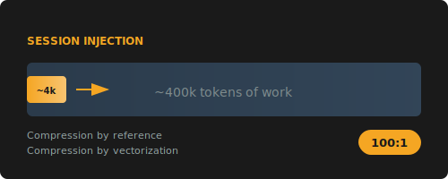
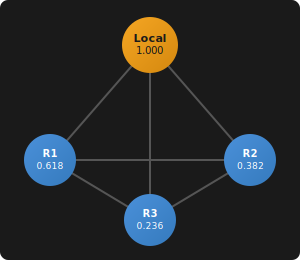

# claude-mem (bpd1069 fork)

<p align="center">
  
</p>

> **~4k tokens to access ~400k tokens of work.**
>
> - **By reference** — inject a semantic index, fetch full observations on-demand
> - **By vectorization** — retrieve relevant memories via similarity search

Fork of [thedotmack/claude-mem](https://github.com/thedotmack/claude-mem) with additional features for standalone deployment, Cursor IDE integration, and alternative vector backends.

**For base documentation, see upstream:** [github.com/thedotmack/claude-mem](https://github.com/thedotmack/claude-mem)

---

## Fork Modifications

### Simplified Memory Access

This fork removes automatic CLAUDE.md file generation. Memory is accessed via MCP tools only:

```
mcp__plugin_claude-mem_mcp-search__search      # Search observations
mcp__plugin_claude-mem_mcp-search__timeline    # Get context around results
mcp__plugin_claude-mem_mcp-search__get_observations  # Fetch full details
```

**Removed:**
- Auto-generated `<claude-mem-context>` sections in CLAUDE.md files
- `/do` and `/make-plan` planner commands (separation of concerns)

**Cleanup existing auto-generated content:**
```bash
bun scripts/regenerate-claude-md.ts --clean
```

---

### Standalone Installation Support

Path resolution supports running claude-mem without Claude Code marketplace:

| Priority | Location | Purpose |
|----------|----------|---------|
| 1 | `CLAUDE_PLUGIN_ROOT` env var | Explicit override |
| 2 | `~/.claude-mem/plugin/` | Standalone installation |
| 3 | `~/.claude/plugins/marketplaces/bpd1069/` | Marketplace fallback |

**Installation:**

```bash
# Build from source
cd /path/to/claude-mem
bun install && bun run build

# Install to standalone location
mkdir -p ~/.claude-mem/plugin/scripts
cp plugin/scripts/*.cjs ~/.claude-mem/plugin/scripts/
cp plugin/package.json ~/.claude-mem/plugin/
cp -r plugin/modes ~/.claude-mem/plugin/
cp -r plugin/skills ~/.claude-mem/plugin/
cp -r plugin/ui ~/.claude-mem/plugin/

# Start worker
cd ~/.claude-mem && bun plugin/scripts/worker-service.cjs start
```

---

### Cursor IDE Integration

Configure MCP server and hooks for Cursor:

**1. MCP Server** (`~/.cursor/mcp.json`):
```json
{
  "mcpServers": {
    "claude-mem": {
      "command": "bun",
      "args": ["/home/YOUR_USER/.claude-mem/plugin/scripts/mcp-server.cjs"]
    }
  }
}
```

**2. Hooks** (`~/.cursor/hooks.json`):
```json
{
  "version": 1,
  "hooks": {
    "beforeSubmitPrompt": [
      { "command": "bun \"/home/YOUR_USER/.claude-mem/plugin/scripts/worker-service.cjs\" hook cursor session-init" },
      { "command": "bun \"/home/YOUR_USER/.claude-mem/plugin/scripts/worker-service.cjs\" hook cursor context" }
    ],
    "afterMCPExecution": [
      { "command": "bun \"/home/YOUR_USER/.claude-mem/plugin/scripts/worker-service.cjs\" hook cursor observation" }
    ],
    "afterShellExecution": [
      { "command": "bun \"/home/YOUR_USER/.claude-mem/plugin/scripts/worker-service.cjs\" hook cursor observation" }
    ],
    "afterFileEdit": [
      { "command": "bun \"/home/YOUR_USER/.claude-mem/plugin/scripts/worker-service.cjs\" hook cursor file-edit" }
    ],
    "stop": [
      { "command": "bun \"/home/YOUR_USER/.claude-mem/plugin/scripts/worker-service.cjs\" hook cursor summarize" }
    ]
  }
}
```

Replace `YOUR_USER` with your username. Restart Cursor after creating these files.

**Note:** Uses `bun` runtime (not `node`) due to `bun:sqlite` dependency.

| Hook | Purpose |
|------|---------|
| `beforeSubmitPrompt` | Initialize session, inject context |
| `afterMCPExecution` | Capture MCP tool usage |
| `afterShellExecution` | Capture shell commands |
| `afterFileEdit` | Capture file edits |
| `stop` | Generate session summary |

---

### LM Studio / Local Model Support

Local LLM inference via [LM Studio](https://lmstudio.ai/):

```json
{
  "AI_PROVIDER": "lmstudio",
  "LMSTUDIO_BASE_URL": "http://localhost:1234/v1",
  "LMSTUDIO_MODEL": "your-model-name"
}
```

Configure via web UI at `http://localhost:37777` or in `~/.claude-mem/settings.json`.

---

### sqlite-vec Vector Backend

Alternative vector backend using [sqlite-vec](https://github.com/asg017/sqlite-vec):

- **No Python dependency** - Pure SQLite
- **Windows support** - No console popup issues
- **Portable** - Single database file
- **Git-LFS export** - Version control your memory

```json
{
  "VECTOR_BACKEND": "sqlite-vec",
  "EMBEDDING_PROVIDER": "lmstudio",
  "EMBEDDING_MODEL": "text-embedding-nomic-embed-text-v1.5",
  "EMBEDDING_DIMENSIONS": "768"
}
```

| Backend | Description |
|---------|-------------|
| `chroma` | ChromaDB via MCP (default) |
| `sqlite-vec` | Local sqlite-vec database |
| `none` | Disable vector search |

---

### Git-LFS Export

Export vector database to a dedicated git repository for backup and versioning.

```json
{
  "GIT_LFS_ENABLED": "true",
  "GIT_LFS_REMOTE": "origin",
  "GIT_LFS_REMOTE_URL": "https://github.com/username/claude-mem-vectors.git",
  "GIT_LFS_AUTO_PUSH": "true",
  "GIT_LFS_IDLE_PUSH_SECONDS": "300"
}
```

**CLI Commands:**

```bash
claude-mem git-sync init --remote <git-url>
claude-mem git-sync status
claude-mem git-sync push
claude-mem git-sync pull
```

**Export Formats:**

```bash
claude-mem export --format=sqlite   # Vector database only
claude-mem export --format=full     # Complete database with vectors
claude-mem export --format=json     # JSON with base64 vectors
claude-mem export --format=json --project=myproject  # Filter by project
```

---

## Milestones

### Current (v9.0.x)

- [x] Standalone installation (`~/.claude-mem/plugin/`)
- [x] Cursor IDE integration (MCP + Hooks)
- [x] LM Studio / local model support
- [x] sqlite-vec vector backend
- [x] Git-LFS export with auto-push
- [x] Removed CLAUDE.md auto-generation (MCP tools only)
- [x] Dynamic marketplace org detection in sync script

### Resurrection Ship (Future)

Team memory sharing via dedicated vector repositories, separate from codebases.

**Concept:** Like the [Resurrection Ship](https://en.battlestarwikiclone.org/wiki/Resurrection_Ship) that extends resurrection range across the Cylon fleet, shared vector repos extend memory across teams and machines.

#### Tetrahedron Model

Federation uses geometric constraints for stability and performance:

<p align="center">
  
</p>

| Node | Priority | Weight |
|------|----------|--------|
| Local | 1.0 | Highest |
| Remote 1 | φ⁻¹ | 0.618 |
| Remote 2 | φ⁻² | 0.382 |
| Remote 3 | φ⁻³ | 0.236 |

*Golden ratio φ ≈ 1.618*

**Constraints:**
- Maximum 3 remote databases (tetrahedron = 4 vertices)
- 5s timeout per remote, 15s total budget
- Remotes are read-only (security)
- Optional allow-list for remote URLs

```json
{
  "FEDERATION_MAX_REMOTES": "3",
  "FEDERATION_QUERY_TIMEOUT_MS": "5000",
  "FEDERATION_PRIORITY_DECAY": "golden",
  "FEDERATION_ALLOW_LIST": "https://memory.team.com",
  "FEDERATION_READ_ONLY": "true"
}
```

#### Schema Adapters

External databases have varying schemas. Adapters transform external formats to internal without modifying our schema:

```typescript
// Register adapter for external DB with different field names
registry.register({
  id: 'team-memory',
  url: 'https://memory.team.com',
  fields: {
    id: 'observation_id',      // their field -> our field
    title: 'summary',
    narrative: 'content',
    timestamp: 'metadata.created_at',  // supports dot notation
  },
  transforms: {
    timestamp: 'iso8601',      // convert ISO to epoch
    embedding: 'base64',       // decode base64 vectors
  }
});
```

**Principle:** Mutable external schemas, immutable internal schema.

**Roadmap:**
- [ ] `GIT_LFS_TEAM_REPOS` - Connect to team memory repositories
- [ ] `attachRemote()` - Mount team vector databases
- [ ] `queryFederated()` - Search across all connected repos with priority weighting
- [ ] Cross-project context injection

---

## License

AGPL-3.0 - Modifications shared in accordance with upstream license.

**Upstream:** [thedotmack/claude-mem](https://github.com/thedotmack/claude-mem)  
**This Fork:** [bpd1069/claude-mem](https://github.com/bpd1069/claude-mem)
